# MoneyIQ-SCD — Technical Specification & Presentation Guide

**Document purpose:** Single reference for academic presentation (PowerPoint), design review, and implementation audit.  
**Project title:** **MoneyIQ-SCD** — Personal Expense Management System (microservices + React UI)  
**Version:** 1.0.0  
**Gateway base URL (all client traffic):** `http://localhost:8080`

Related documents: [README.md](README.md) (quick start), [DESIGN_PATTERNS.md](DESIGN_PATTERNS.md) (pattern theory).

---

## Table of contents

1. [PowerPoint slide flow (recommended)](#1-powerpoint-slide-flow-recommended)
2. [Project aim and scope](#2-project-aim-and-scope)
3. [Functional requirements](#3-functional-requirements)
4. [Non-functional requirements](#4-non-functional-requirements)
5. [High-level architecture](#5-high-level-architecture)
6. [Component diagram & provided/required interfaces](#6-component-diagram--providedrequired-interfaces)
7. [Detailed design by module](#7-detailed-design-by-module)
8. [Class diagrams (per module)](#8-class-diagrams-per-module)
9. [Sequence diagrams](#9-sequence-diagrams)
10. [REST API contract (every endpoint)](#10-rest-api-contract-every-endpoint)
11. [Implementation](#11-implementation)
12. [Data model](#12-data-model)
13. [Security architecture](#13-security-architecture)
14. [Error handling](#14-error-handling)


1.1.Rationale for Selecting the Problem
During the Event-Driven Programming course, our team previously implemented a basic version of a personal expense management system. However, that implementation followed a traditional monolithic architecture, where the entire application was developed as a single tightly coupled codebase without the application of structured architectural principles, component-based software development methodologies, or modular abstraction boundaries.
As a result, the previous system suffered from several significant software engineering limitations. The codebase was highly coupled, poorly structured, difficult to maintain, challenging to extend, and increasingly complex to understand as the project evolved. These limitations provided us with valuable practical insight into the consequences of weak architectural design and the absence of proper component separation.
Therefore, the primary focus of this project is not the business functionality of personal expense management itself. Instead, the project concentrates on the architectural and engineering perspective of software development. Our goal is to design, model, decouple, and execute a collection of self-contained and independently deployable software components that communicate exclusively through lightweight network-based interfaces without compile-time dependencies or shared memory-space coupling.
This approach enables us to gain deeper practical experience in modern software architecture, distributed component integration, modular system design, and independent service orchestration within a limited timeframe while producing a more scalable, maintainable, and extensible system. 
---

## 1. PowerPoint slide flow (recommended)

| Slide # | Title | Content source (this doc) |
|--------|--------|---------------------------|
| 1 | Title & team | §2 Project title, aim |
| 2 | Problem statement | Why personal expense + auth + reports matter |
| 3 | Project objectives | §2 Aim, learning outcomes (GoF, microservices) |
| 4 | Functional requirements | §3 table FR-01…FR-n |
| 5 | Non-functional requirements | §4 NFR table |
| 6 | High-level architecture | §5 diagram + narrative |
| 7 | Technology stack | §11 table |
| 8 | Component diagram | §6 (lollipop/socket) |
| 9 | Auth service design | §7.1 + §8.1 class diagram |
| 10 | Expense service design | §7.2 + §8.2 |
| 11 | PDF & gateway design | §7.3–7.4 + patterns |
| 12 | Sequence: registration | §9.1 |
| 13 | Sequence: login + JWT | §9.2 |
| 14 | Sequence: create expense | §9.3 |
| 15 | Sequence: PDF export | §9.4 |
| 16 | API overview | §10 summary table |
| 17 | Demo / screenshots | Live UI |
| 18 | Conclusion & future work | Multi-tenant, refresh tokens, etc. |

---

## 2. Project aim and scope

### 2.1 Project title

**MoneyIQ-SCD** — *Personal Expense Management System using Contract-First Microservices*

### 2.2 Aim

Build a **distributed expense management application** where:

- Users **register**, **verify email**, and **log in** securely.
- Authenticated users **create, read, update, delete, and filter** personal expenses.
- Users **export expense reports as PDF** from HTML.
- Each business capability runs in an **independent microservice** with clear REST contracts.
- Each backend module demonstrates **one Gang-of-Four (GoF) design pattern** and **solid OOP** (encapsulation, abstraction, inheritance, polymorphism, composition).

### 2.3 Logical reasoning (why this architecture)

| Decision | Reason |
|----------|--------|
| Microservices | Auth, expenses, and PDF have different scaling and technology needs; failures are isolated. |
| Integration gateway | Single public URL; JWT validation and `X-User-Id` injection happen once, not in every service. |
| Auth owns JWT only | Avoids duplicate security logic; expense service trusts gateway boundary. |
| MongoDB per domain | `auth_db` vs `expense_db` — no shared schema; true service isolation. |
| GoF per module | Teaches deliberate pattern use, not accidental structure. |

### 2.4 Out of scope (current version)

- Payment processing, multi-currency exchange, shared family accounts.
- Refresh tokens / OAuth2 social login.
- Direct browser access to microservice ports in production (only gateway exposed).

---

## 3. Functional requirements

| ID | Requirement | Service | Priority |
|----|-------------|---------|----------|
| FR-01 | User can register with email, password, name, optional phone/metadata | Auth | Must |
| FR-02 | System sends email verification (OTP or link, configurable) | Auth | Must |
| FR-03 | User can verify email before full access | Auth | Must |
| FR-04 | User can log in and receive JWT | Auth | Must |
| FR-05 | System validates JWT and returns user identity | Auth | Must |
| FR-06 | User can create expense (amount, category, reason, location, date) | Expense | Must |
| FR-07 | User can list own expenses | Expense | Must |
| FR-08 | User can filter expenses by category, amount range, date range | Expense | Must |
| FR-09 | User can view, update, delete a single expense | Expense | Must |
| FR-10 | User can convert HTML to PDF download | PDF | Must |
| FR-11 | All UI calls go through API gateway | Integration | Must |
| FR-12 | Expense routes require valid JWT at gateway | Integration | Must |
| FR-13 | Health check per service | All | Should |

---

## 4. Non-functional requirements

| ID | Requirement | How met |
|----|-------------|---------|
| NFR-01 | Service isolation | No shared libraries; REST only between services |
| NFR-02 | Independent deployability | Each service has own runtime (Java, Python, Node) |
| NFR-03 | Password security | BCrypt hashing in auth-service |
| NFR-04 | Stateless PDF service | No database; HTML in → PDF out |
| NFR-05 | Config via environment | `.env` per service; not committed |
| NFR-06 | CORS for dev UI | Gateway handles OPTIONS + Allow-Origin |
| NFR-07 | Teachable design | One GoF pattern documented per module |

---

## 5. High-level architecture

### 5.1 Logical view

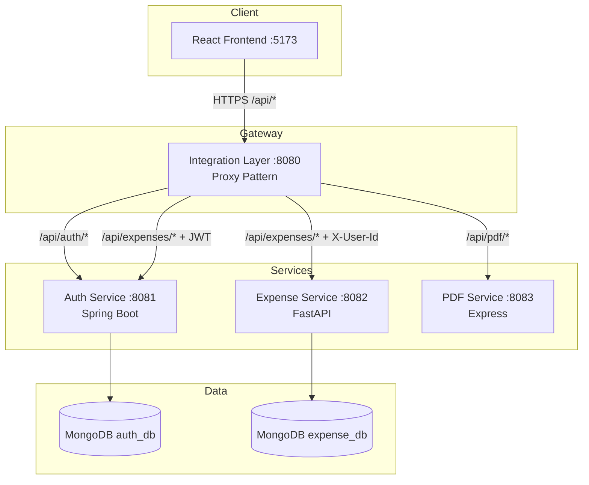
```mermaid
flowchart TB
    subgraph Client
        UI[React Frontend :5173]
    end

    subgraph Gateway
        GW[Integration Layer :8080<br/>Proxy Pattern]
    end

    subgraph Services
        AUTH[Auth Service :8081<br/>Spring Boot]
        EXP[Expense Service :8082<br/>FastAPI]
        PDF[PDF Service :8083<br/>Express]
    end

    subgraph Data
        M1[(MongoDB auth_db)]
        M2[(MongoDB expense_db)]
    end

    UI -->|HTTPS /api/*| GW
    GW -->|/api/auth/*| AUTH
    GW -->|/api/expenses/* + JWT| AUTH
    GW -->|/api/expenses/* + X-User-Id| EXP
    GW -->|/api/pdf/*| PDF
    AUTH --> M1
    EXP --> M2
```

### 5.2 Request path (reasoning)

1. **Browser** calls `http://localhost:5173/api/...` → Vite dev proxy forwards to **:8080**.
2. **Gateway** either proxies publicly (auth, pdf) or **validates JWT** then proxies (expenses).
3. **Auth** issues and validates tokens; **Expense** never parses JWT — only reads `X-User-Id`.
4. This **separation of concerns** is intentional: expense code stays simple; security is centralized.

### 5.3 Deployment view

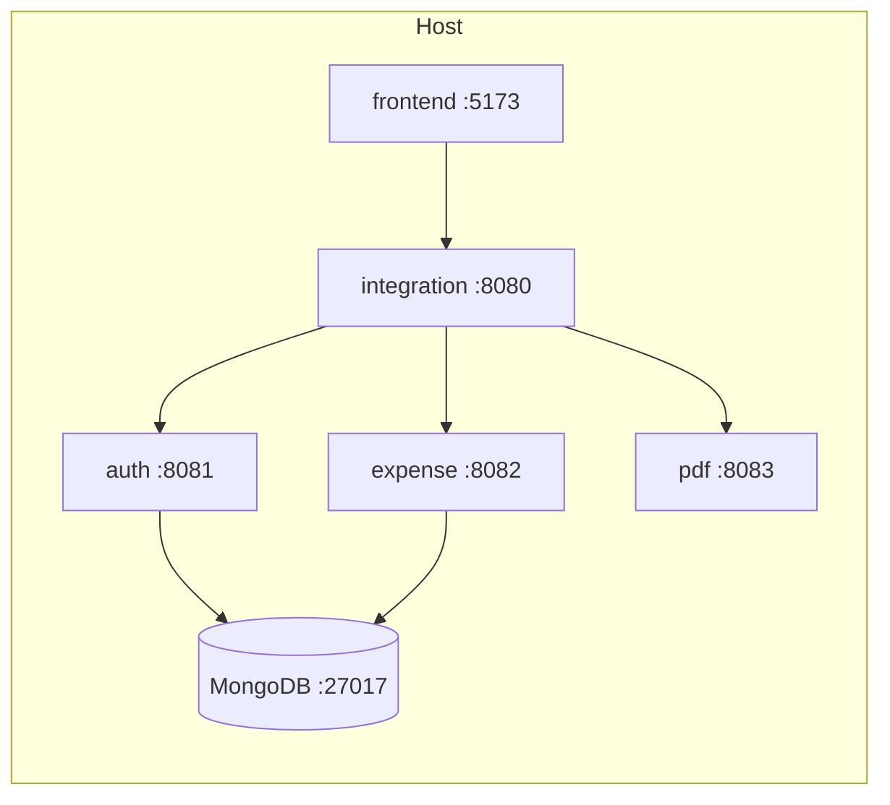
```mermaid
flowchart LR
    subgraph Host
        P5173[frontend :5173]
        P8080[integration :8080]
        P8081[auth :8081]
        P8082[expense :8082]
        P8083[pdf :8083]
        P27017[(MongoDB :27017)]
    end
    P5173 --> P8080
    P8080 --> P8081
    P8080 --> P8082
    P8080 --> P8083
    P8081 --> P27017
    P8082 --> P27017
```

---

## 6. Component diagram & provided/required interfaces

In UML component diagrams:

- **Provided interface** — drawn as a **lollipop** (circle on a stick): what the component **offers** to others.
- **Required interface** — drawn as a **socket** (half-circle): what the component **needs** from others.

### 6.1 Component diagram (Mermaid)

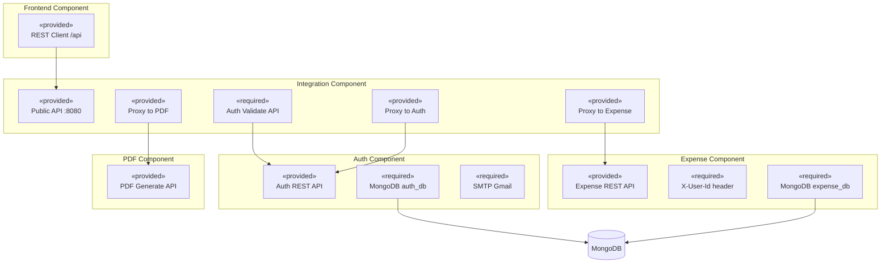
```mermaid
flowchart TB
    subgraph Frontend["Frontend Component"]
        UI_API["«provided»<br/>REST Client /api"]
    end

    subgraph Gateway["Integration Component"]
        GW_PROV["«provided»<br/>Public API :8080"]
        GW_REQ_AUTH["«required»<br/>Auth Validate API"]
        GW_PROV_AUTH["«provided»<br/>Proxy to Auth"]
        GW_PROV_EXP["«provided»<br/>Proxy to Expense"]
        GW_PROV_PDF["«provided»<br/>Proxy to PDF"]
    end

    subgraph Auth["Auth Component"]
        AUTH_PROV["«provided»<br/>Auth REST API"]
        AUTH_REQ_DB["«required»<br/>MongoDB auth_db"]
        AUTH_REQ_MAIL["«required»<br/>SMTP Gmail"]
    end

    subgraph Expense["Expense Component"]
        EXP_PROV["«provided»<br/>Expense REST API"]
        EXP_REQ_HDR["«required»<br/>X-User-Id header"]
        EXP_REQ_DB["«required»<br/>MongoDB expense_db"]
    end

    subgraph PDF["PDF Component"]
        PDF_PROV["«provided»<br/>PDF Generate API"]
    end

    UI_API --> GW_PROV
    GW_REQ_AUTH --> AUTH_PROV
    GW_PROV_AUTH --> AUTH_PROV
    GW_PROV_EXP --> EXP_PROV
    GW_PROV_PDF --> PDF_PROV
    AUTH_REQ_DB --> MONGO[(MongoDB)]
    EXP_REQ_DB --> MONGO
```

### 6.2 Interface catalogue (contract-level)

#### 6.2.1 Auth service — provided interfaces

| Interface | Protocol | Operations |
|-----------|----------|------------|
| `IAuthPublicAPI` | HTTP/JSON | `register`, `verify`, `verifyLink`, `login` |
| `IAuthInternalAPI` | HTTP/JSON | `validate` (Bearer JWT) |
| `IHealth` | HTTP/JSON | `GET /health` |

#### 6.2.2 Expense service — provided interfaces

| Interface | Protocol | Operations |
|-----------|----------|------------|
| `IExpenseAPI` | HTTP/JSON | CRUD + list + filter on `/api/expenses` |
| `IHealth` | HTTP/JSON | `GET /health` |

#### 6.2.3 Expense service — required interfaces

| Interface | Source | Purpose |
|-----------|--------|---------|
| `IUserContext` | Gateway header | `X-User-Id` (required), `X-User-Email` (optional) |

#### 6.2.4 PDF service — provided interfaces

| Interface | Protocol | Operations |
|-----------|----------|------------|
| `IPdfGenerate` | HTTP | `POST /api/pdf/generate` → `application/pdf` |

#### 6.2.5 Integration layer — provided interfaces

| Interface | Protocol | Operations |
|-----------|----------|------------|
| `IGateway` | HTTP | Routes under `/api/auth`, `/api/expenses`, `/api/pdf`, `/health` |

#### 6.2.6 Integration layer — required interfaces

| Interface | Target | When |
|-----------|--------|------|
| `IAuthValidate` | Auth `:8081` | Before every `/api/expenses` request |

### 6.3 In-code interfaces (programming languages)

| Language | Interface / contract | Implementations |
|----------|-------------------|-----------------|
| Java | `VerificationStrategy` | `OtpVerificationStrategy`, `LinkVerificationStrategy` |
| Java | `LoginHandler` (abstract) | `UserExistenceHandler`, `EmailVerificationHandler`, `CredentialValidationHandler` |
| Java | `UserRepository` | Spring Data generated |
| Python | `ExpenseFilterStrategy` (ABC) | `DateFilterStrategy`, `AmountFilterStrategy`, `CategoryFilterStrategy` |
| JavaScript | `PdfRenderer` (base class) | `PuppeteerPdfRenderer` |
| TypeScript | `ServiceTarget`, `AuthenticatedUser` | Used by `ServiceProxy`, `IntegrationModule` |

---

## 7. Detailed design by module

### 7.1 Auth service (Spring Boot) — six pattern modules + config

| File | GoF pattern | Responsibility |
|------|-------------|----------------|
| `DatabaseModule.java` | **Singleton** | Shared `MongoClient`; `User` entity; `UserRepository` |
| `RegistrationModule.java` | **Builder** | `UserRegistrationBuilder` assembles `User` from dynamic fields |
| `VerificationModule.java` | **Strategy** | OTP vs link verification |
| `LoginModule.java` | **Chain of Responsibility** | Login validation chain + JWT |
| `AuthenticationFacadeModule.java` | **Facade** | Unified API for controllers |
| `Main.java` | **Adapter** | HTTP ↔ facade |
| `AppConfig.java` | — | `PasswordEncoder` bean |

**Layering (logical):**

```
HTTP (Adapter: Main)
    → Facade (AuthenticationFacadeModule)
        → RegistrationModule | VerificationModule | LoginModule
            → UserRepository / JavaMailSender / PasswordEncoder
                → MongoDB (auth_db)
```

### 7.2 Expense service (FastAPI) — single module file

| Layer | Class | Role |
|-------|-------|------|
| API | `ExpenseModule` | FastAPI routes, `_require_user_id` |
| Service | `ExpenseService` | Business rules |
| Repository | `ExpenseRepository` | MongoDB CRUD |
| Strategy | `ExpenseFilterStrategy` + implementations | Query building |
| Context | `ExpenseFilterContext` | Runs strategies in sequence |
| Singleton | `MongoConnectionManager` | One motor client |
| DTO | `ExpenseCreate`, `ExpenseUpdate` | Pydantic validation |

### 7.3 PDF service (Express)

| Class | Pattern | Role |
|-------|---------|------|
| `PdfRenderer` | Abstraction | `render(html, options)` contract |
| `PuppeteerPdfRenderer` | Concrete product | Puppeteer implementation |
| `PdfRendererFactory` | **Factory Method** | `create(type)` |
| `PdfModule` | Facade-like HTTP shell | Routes + body parsing |

### 7.4 Integration layer (Express + TypeScript)

| Class | Pattern | Role |
|-------|---------|------|
| `ServiceProxy` | **Proxy** | Forward HTTP; inject headers |
| `IntegrationModule` | Orchestrator | CORS, auth middleware, route mounting |

**Critical design rule:** No `express.json()` on gateway — body must stream to upstream unchanged.

---

## 8. Class diagrams (per module)

### 8.1 Auth — DatabaseModule (Singleton)

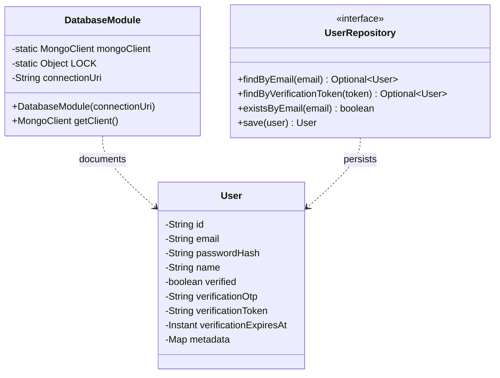
```mermaid
classDiagram
    class DatabaseModule {
        -static MongoClient mongoClient
        -static Object LOCK
        -String connectionUri
        +DatabaseModule(connectionUri)
        +MongoClient getClient()
    }
    class User {
        -String id
        -String email
        -String passwordHash
        -String name
        -boolean verified
        -String verificationOtp
        -String verificationToken
        -Instant verificationExpiresAt
        -Map metadata
    }
    class UserRepository {
        <<interface>>
        +findByEmail(email) Optional~User~
        +findByVerificationToken(token) Optional~User~
        +existsByEmail(email) boolean
        +save(user) User
    }
    DatabaseModule ..> User : documents
    UserRepository ..> User : persists
```

### 8.2 Auth — RegistrationModule (Builder)

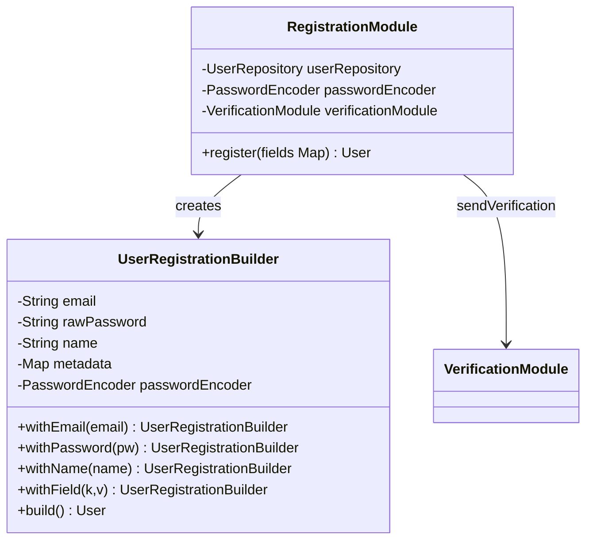
```mermaid
classDiagram
    class RegistrationModule {
        -UserRepository userRepository
        -PasswordEncoder passwordEncoder
        -VerificationModule verificationModule
        +register(fields Map) User
    }
    class UserRegistrationBuilder {
        -String email
        -String rawPassword
        -String name
        -Map metadata
        -PasswordEncoder passwordEncoder
        +withEmail(email) UserRegistrationBuilder
        +withPassword(pw) UserRegistrationBuilder
        +withName(name) UserRegistrationBuilder
        +withField(k,v) UserRegistrationBuilder
        +build() User
    }
    RegistrationModule --> UserRegistrationBuilder : creates
    RegistrationModule --> VerificationModule : sendVerification
```

### 8.3 Auth — VerificationModule (Strategy)

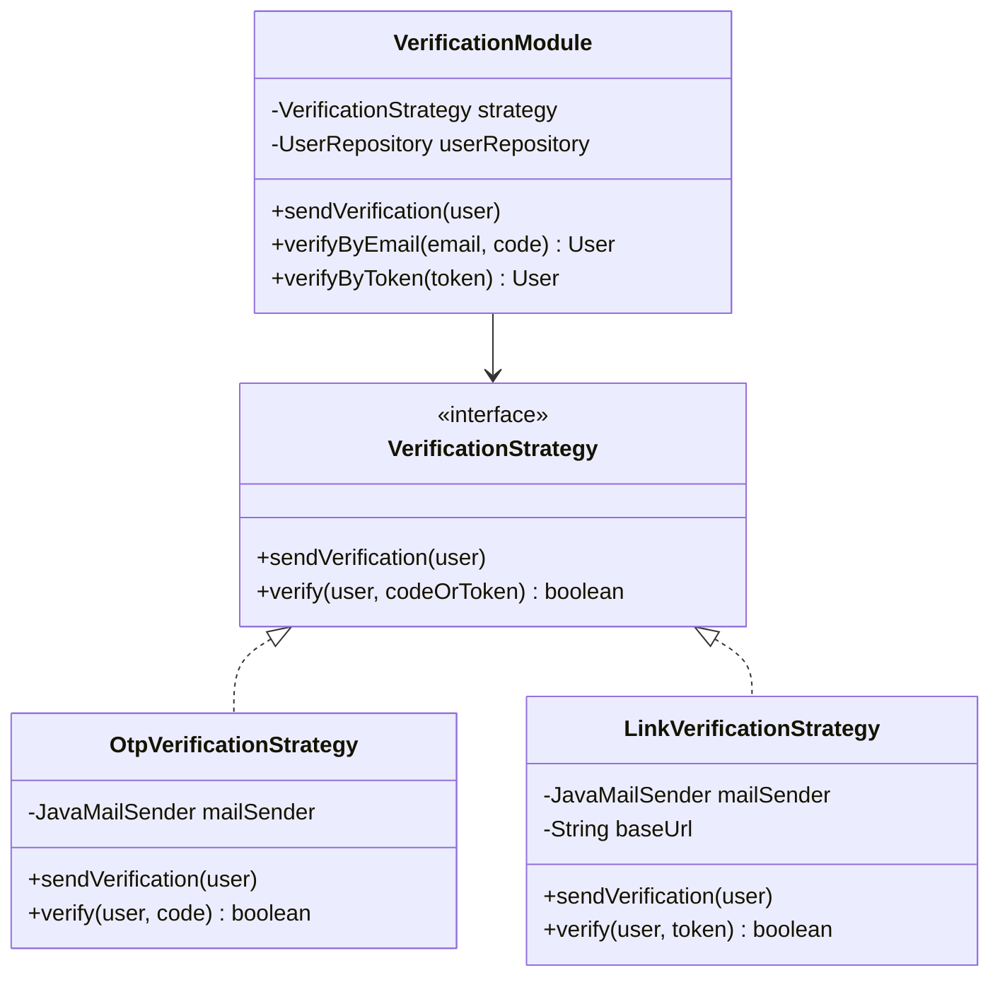
```mermaid
classDiagram
    class VerificationModule {
        -VerificationStrategy strategy
        -UserRepository userRepository
        +sendVerification(user)
        +verifyByEmail(email, code) User
        +verifyByToken(token) User
    }
    class VerificationStrategy {
        <<interface>>
        +sendVerification(user)
        +verify(user, codeOrToken) boolean
    }
    class OtpVerificationStrategy {
        -JavaMailSender mailSender
        +sendVerification(user)
        +verify(user, code) boolean
    }
    class LinkVerificationStrategy {
        -JavaMailSender mailSender
        -String baseUrl
        +sendVerification(user)
        +verify(user, token) boolean
    }
    VerificationModule --> VerificationStrategy
    VerificationStrategy <|.. OtpVerificationStrategy
    VerificationStrategy <|.. LinkVerificationStrategy
```

### 8.4 Auth — LoginModule (Chain of Responsibility)

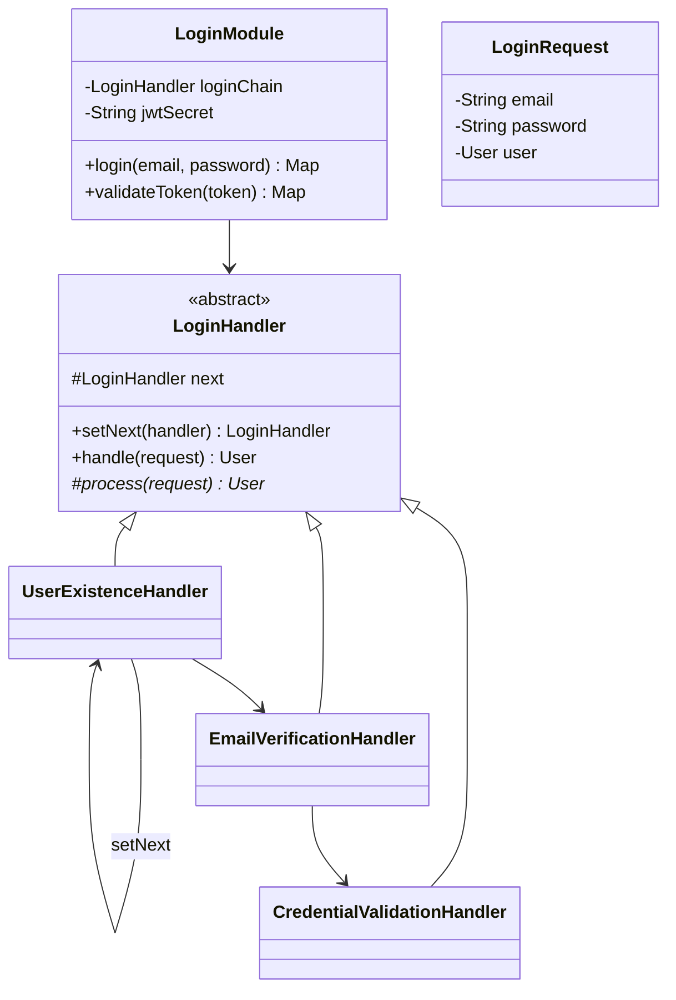
```mermaid
classDiagram
    class LoginModule {
        -LoginHandler loginChain
        -String jwtSecret
        +login(email, password) Map
        +validateToken(token) Map
    }
    class LoginHandler {
        <<abstract>>
        #LoginHandler next
        +setNext(handler) LoginHandler
        +handle(request) User
        #process(request) User*
    }
    class UserExistenceHandler
    class EmailVerificationHandler
    class CredentialValidationHandler
    class LoginRequest {
        -String email
        -String password
        -User user
    }
    LoginHandler <|-- UserExistenceHandler
    LoginHandler <|-- EmailVerificationHandler
    LoginHandler <|-- CredentialValidationHandler
    LoginModule --> LoginHandler
    UserExistenceHandler --> UserExistenceHandler : setNext
    UserExistenceHandler --> EmailVerificationHandler
    EmailVerificationHandler --> CredentialValidationHandler
```

### 8.5 Auth — Facade & Adapter

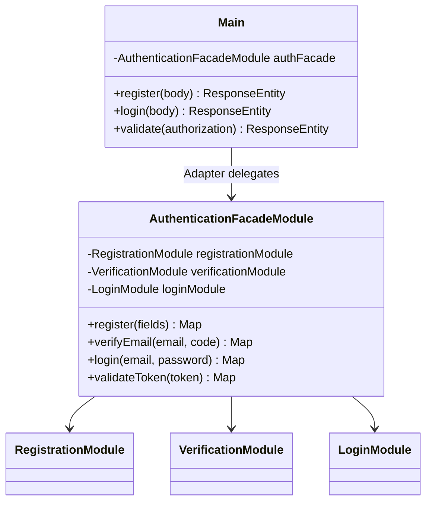
```mermaid
classDiagram
    class Main {
        -AuthenticationFacadeModule authFacade
        +register(body) ResponseEntity
        +login(body) ResponseEntity
        +validate(authorization) ResponseEntity
    }
    class AuthenticationFacadeModule {
        -RegistrationModule registrationModule
        -VerificationModule verificationModule
        -LoginModule loginModule
        +register(fields) Map
        +verifyEmail(email, code) Map
        +login(email, password) Map
        +validateToken(token) Map
    }
    Main --> AuthenticationFacadeModule : Adapter delegates
    AuthenticationFacadeModule --> RegistrationModule
    AuthenticationFacadeModule --> VerificationModule
    AuthenticationFacadeModule --> LoginModule
```

### 8.6 Expense — ExpenseModule (Strategy)

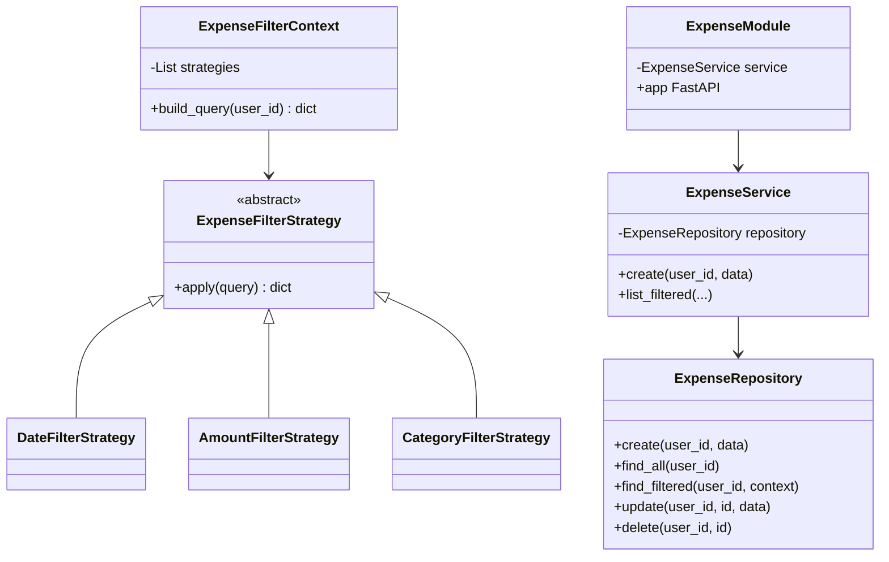
```mermaid
classDiagram
    class ExpenseFilterStrategy {
        <<abstract>>
        +apply(query) dict
    }
    class DateFilterStrategy
    class AmountFilterStrategy
    class CategoryFilterStrategy
    class ExpenseFilterContext {
        -List strategies
        +build_query(user_id) dict
    }
    class ExpenseRepository {
        +create(user_id, data)
        +find_all(user_id)
        +find_filtered(user_id, context)
        +update(user_id, id, data)
        +delete(user_id, id)
    }
    class ExpenseService {
        -ExpenseRepository repository
        +create(user_id, data)
        +list_filtered(...)
    }
    class ExpenseModule {
        -ExpenseService service
        +app FastAPI
    }
    ExpenseFilterStrategy <|-- DateFilterStrategy
    ExpenseFilterStrategy <|-- AmountFilterStrategy
    ExpenseFilterStrategy <|-- CategoryFilterStrategy
    ExpenseFilterContext --> ExpenseFilterStrategy
    ExpenseService --> ExpenseRepository
    ExpenseModule --> ExpenseService
```

### 8.7 PDF — Factory Method

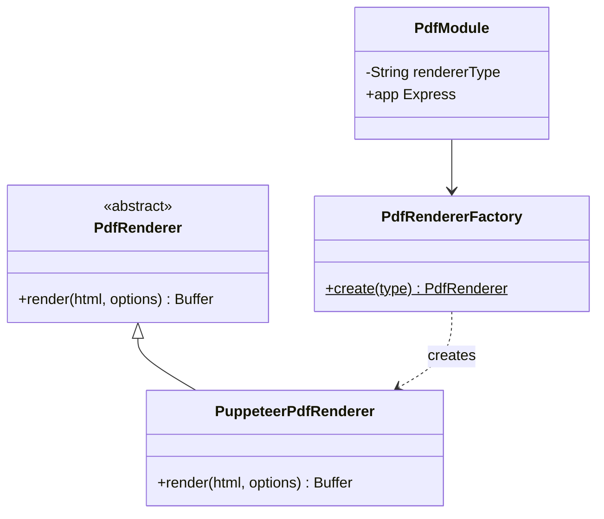
```mermaid
classDiagram
    class PdfRenderer {
        <<abstract>>
        +render(html, options) Buffer
    }
    class PuppeteerPdfRenderer {
        +render(html, options) Buffer
    }
    class PdfRendererFactory {
        +create(type)$ PdfRenderer
    }
    class PdfModule {
        -String rendererType
        +app Express
    }
    PdfRenderer <|-- PuppeteerPdfRenderer
    PdfRendererFactory ..> PuppeteerPdfRenderer : creates
    PdfModule --> PdfRendererFactory
```

### 8.8 Integration — Proxy

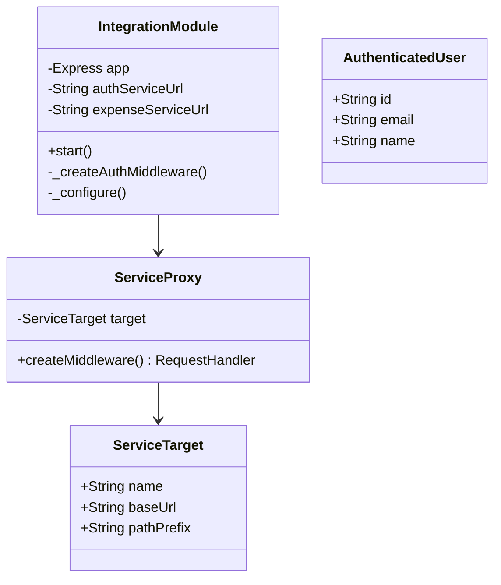
```mermaid
classDiagram
    class IntegrationModule {
        -Express app
        -String authServiceUrl
        -String expenseServiceUrl
        +start()
        -_createAuthMiddleware()
        -_configure()
    }
    class ServiceProxy {
        -ServiceTarget target
        +createMiddleware() RequestHandler
    }
    class ServiceTarget {
        +String name
        +String baseUrl
        +String pathPrefix
    }
    class AuthenticatedUser {
        +String id
        +String email
        +String name
    }
    IntegrationModule --> ServiceProxy
    ServiceProxy --> ServiceTarget
```

---

## 9. Sequence diagrams

### 9.1 User registration + OTP email

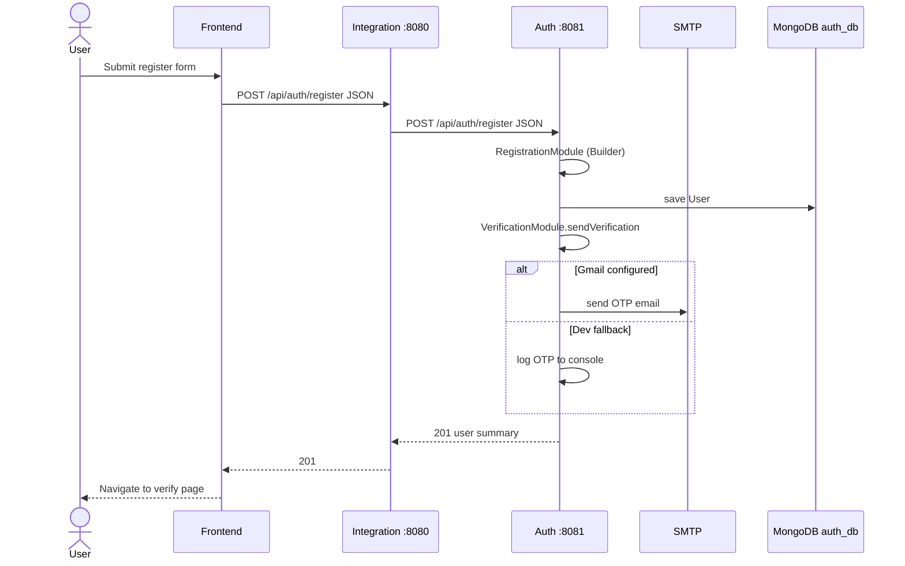
```mermaid
sequenceDiagram
    actor User
    participant UI as Frontend
    participant GW as Integration :8080
    participant Auth as Auth :8081
    participant Mail as SMTP
    participant DB as MongoDB auth_db

    User->>UI: Submit register form
    UI->>GW: POST /api/auth/register JSON
    GW->>Auth: POST /api/auth/register JSON
    Auth->>Auth: RegistrationModule (Builder)
    Auth->>DB: save User
    Auth->>Auth: VerificationModule.sendVerification
  alt Gmail configured
        Auth->>Mail: send OTP email
    else Dev fallback
        Auth->>Auth: log OTP to console
    end
    Auth-->>GW: 201 user summary
    GW-->>UI: 201
    UI-->>User: Navigate to verify page
```

### 9.2 Login + JWT validation at gateway

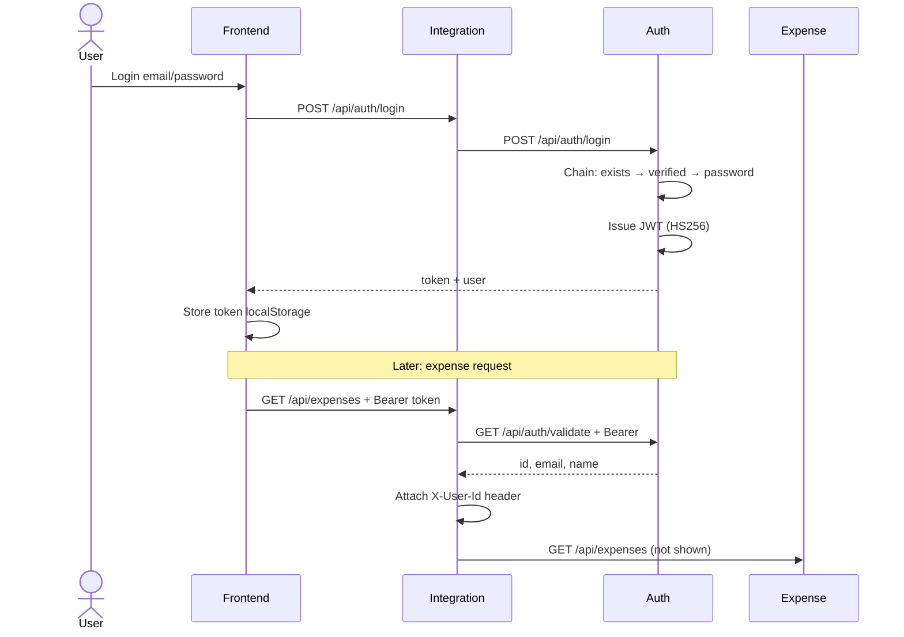
```mermaid
sequenceDiagram
    actor User
    participant UI as Frontend
    participant GW as Integration
    participant Auth as Auth

    User->>UI: Login email/password
    UI->>GW: POST /api/auth/login
    GW->>Auth: POST /api/auth/login
    Auth->>Auth: Chain: exists → verified → password
    Auth->>Auth: Issue JWT (HS256)
    Auth-->>UI: token + user
    UI->>UI: Store token localStorage

    Note over UI,Auth: Later: expense request

    UI->>GW: GET /api/expenses + Bearer token
    GW->>Auth: GET /api/auth/validate + Bearer
    Auth-->>GW: id, email, name
    GW->>GW: Attach X-User-Id header
    GW->>Expense: GET /api/expenses (not shown)
```

### 9.3 Create expense (authenticated)

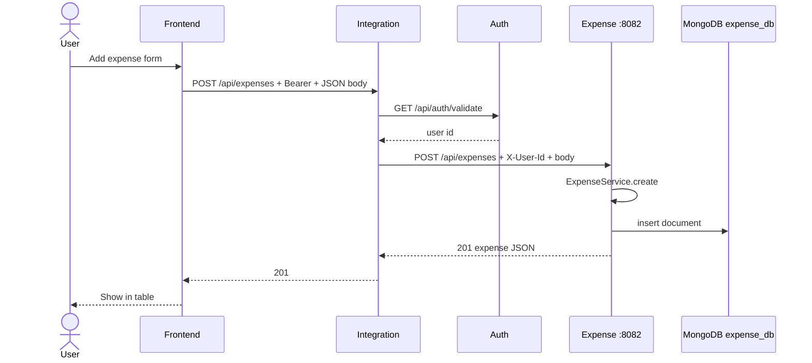
```mermaid
sequenceDiagram
    actor User
    participant UI as Frontend
    participant GW as Integration
    participant Auth as Auth
    participant Exp as Expense :8082
    participant DB as MongoDB expense_db

    User->>UI: Add expense form
    UI->>GW: POST /api/expenses + Bearer + JSON body
    GW->>Auth: GET /api/auth/validate
    Auth-->>GW: user id
    GW->>Exp: POST /api/expenses + X-User-Id + body
    Exp->>Exp: ExpenseService.create
    Exp->>DB: insert document
    Exp-->>GW: 201 expense JSON
    GW-->>UI: 201
    UI-->>User: Show in table
```

### 9.4 PDF generation

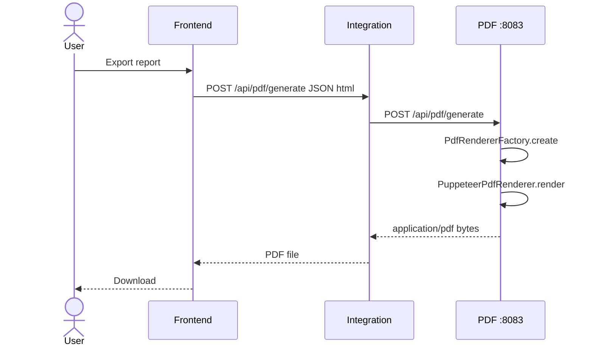
```mermaid
sequenceDiagram
    actor User
    participant UI as Frontend
    participant GW as Integration
    participant PDF as PDF :8083

    User->>UI: Export report
    UI->>GW: POST /api/pdf/generate JSON html
    GW->>PDF: POST /api/pdf/generate
    PDF->>PDF: PdfRendererFactory.create
    PDF->>PDF: PuppeteerPdfRenderer.render
    PDF-->>GW: application/pdf bytes
    GW-->>UI: PDF file
    UI-->>User: Download
```

---

## 10. REST API contract (every endpoint)

**Convention:** All examples use gateway `http://localhost:8080`.  
**Errors:** JSON `{ "error": "message" }` unless noted.

### 10.1 Summary table

| Method | Path | Auth | Service | Description |
|--------|------|------|---------|-------------|
| GET | `/health` | No | Gateway | Gateway health + upstream URLs |
| GET | `/health` (direct) | No | Each service | Per-service liveness |
| POST | `/api/auth/register` | No | Auth | Register user |
| POST | `/api/auth/verify` | No | Auth | Verify OTP |
| GET | `/api/auth/verify/link` | No | Auth | Verify by token |
| POST | `/api/auth/login` | No | Auth | Login → JWT |
| GET | `/api/auth/validate` | Bearer | Auth | Validate JWT |
| POST | `/api/expenses` | Bearer | Expense | Create expense |
| GET | `/api/expenses` | Bearer | Expense | List / filter |
| GET | `/api/expenses/{id}` | Bearer | Expense | Get one |
| PUT | `/api/expenses/{id}` | Bearer | Expense | Update |
| DELETE | `/api/expenses/{id}` | Bearer | Expense | Delete |
| POST | `/api/pdf/generate` | No* | PDF | HTML → PDF |

\*PDF is public at gateway today; protect in production if needed.

---

### 10.2 Gateway — GET `/health`

**Response 200:**

```json
{
  "status": "ok",
  "service": "integration-layer",
  "upstream": {
    "auth": "http://localhost:8081",
    "expense": "http://localhost:8082",
    "pdf": "http://localhost:8083"
  }
}
```

---

### 10.3 POST `/api/auth/register`

**Request:**

```json
{
  "email": "student@university.edu",
  "password": "SecurePass123!",
  "name": "Alex Student",
  "phone": "555-0100"
}
```

**Response 201:**

```json
{
  "id": "665f1a2b3c4d5e6f7a8b9c0d",
  "email": "student@university.edu",
  "name": "Alex Student",
  "verified": false,
  "message": "Registration successful. Please verify your email."
}
```

**curl:**

```bash
curl -X POST http://localhost:8080/api/auth/register \
  -H "Content-Type: application/json" \
  -d "{\"email\":\"student@university.edu\",\"password\":\"SecurePass123!\",\"name\":\"Alex Student\"}"
```

**Errors 400:** duplicate email, missing email/password.

---

### 10.4 POST `/api/auth/verify`

**Request:**

```json
{
  "email": "student@university.edu",
  "code": "482910"
}
```

**Response 200:**

```json
{
  "id": "665f1a2b3c4d5e6f7a8b9c0d",
  "email": "student@university.edu",
  "verified": true,
  "message": "Email verified successfully."
}
```

---

### 10.5 GET `/api/auth/verify/link?token={token}`

**Response 200:** Same shape as verify; used when `VERIFICATION_STRATEGY=link`.

```bash
curl "http://localhost:8080/api/auth/verify/link?token=uuid-token-here"
```

---

### 10.6 POST `/api/auth/login`

**Request:**

```json
{
  "email": "student@university.edu",
  "password": "SecurePass123!"
}
```

**Response 200:**

```json
{
  "token": "eyJhbGciOiJIUzI1NiIsInR5cCI6IkpXVCJ9...",
  "user": {
    "id": "665f1a2b3c4d5e6f7a8b9c0d",
    "email": "student@university.edu",
    "name": "Alex Student"
  }
}
```

**Errors 400:** invalid credentials, email not verified.

---

### 10.7 GET `/api/auth/validate`

**Headers:** `Authorization: Bearer <token>`

**Response 200:**

```json
{
  "id": "665f1a2b3c4d5e6f7a8b9c0d",
  "email": "student@university.edu",
  "name": "Alex Student"
}
```

**Errors 400:** missing Bearer; invalid/expired token.

---

### 10.8 POST `/api/expenses`

**Headers:** `Authorization: Bearer <token>`

**Request:**

```json
{
  "amount": 45.99,
  "category": "Food",
  "reason": "Team lunch",
  "location": "Campus cafeteria",
  "date": "2026-05-30T12:30:00Z"
}
```

**Response 201:**

```json
{
  "id": "665f1a2b3c4d5e6f7a8b9c0e",
  "user_id": "665f1a2b3c4d5e6f7a8b9c0d",
  "amount": 45.99,
  "category": "Food",
  "reason": "Team lunch",
  "location": "Campus cafeteria",
  "date": "2026-05-30T12:30:00",
  "created_at": "2026-05-31T10:00:00",
  "updated_at": "2026-05-31T10:00:00"
}
```

**curl:**

```bash
curl -X POST http://localhost:8080/api/expenses \
  -H "Content-Type: application/json" \
  -H "Authorization: Bearer YOUR_JWT" \
  -d "{\"amount\":45.99,\"category\":\"Food\",\"reason\":\"Team lunch\",\"location\":\"Campus\",\"date\":\"2026-05-30T12:30:00Z\"}"
```

**Errors 401:** missing/invalid token (gateway). **401:** missing `X-User-Id` if calling expense :8082 directly.

---

### 10.9 GET `/api/expenses`

**Headers:** `Authorization: Bearer <token>`

**Query parameters (optional — Strategy pattern):**

| Param | Type | Description |
|-------|------|-------------|
| `category` | string | Case-insensitive regex match |
| `min_amount` | number | Minimum amount |
| `max_amount` | number | Maximum amount |
| `start_date` | ISO 8601 | Date ≥ |
| `end_date` | ISO 8601 | Date ≤ |

**Response 200:** Array of expense objects.

```bash
curl "http://localhost:8080/api/expenses?category=Food&min_amount=10" \
  -H "Authorization: Bearer YOUR_JWT"
```

---

### 10.10 GET `/api/expenses/{id}`

**Response 200:** Single expense object. **404:** not found or wrong user.

---

### 10.11 PUT `/api/expenses/{id}`

**Request (partial update allowed):**

```json
{
  "amount": 49.99,
  "reason": "Updated lunch"
}
```

**Response 200:** Updated expense. **404:** not found.

---

### 10.12 DELETE `/api/expenses/{id}`

**Response 204:** No body. **404:** not found.

---

### 10.13 POST `/api/pdf/generate`

**Request (JSON):**

```json
{
  "html": "<html><body><h1>Expense Report</h1><p>Total: $120.00</p></body></html>",
  "options": { "format": "A4" }
}
```

**Response 200:** `Content-Type: application/pdf` (binary).

**Alternative:** `Content-Type: text/html` with raw HTML body.

```bash
curl -X POST http://localhost:8080/api/pdf/generate \
  -H "Content-Type: application/json" \
  -d "{\"html\":\"<html><body><h1>Report</h1></body></html>\"}" \
  --output report.pdf
```

---

## 11. Implementation

### 11.1 Technology stack

| Layer | Technology | Version (typical) |
|-------|------------|-----------------|
| Frontend | React, Vite, Tailwind, Axios | 18.x / 5.x |
| Gateway | Node.js, Express, TypeScript, http-proxy-middleware | 18+ / 4.x |
| Auth | Java, Spring Boot, Spring Data MongoDB, JJWT, JavaMail | 21 / 3.4.5 |
| Expense | Python, FastAPI, Motor, Pydantic | 3.11+ |
| PDF | Node.js, Express, Puppeteer | 18+ |
| Database | MongoDB | 6.x / 7.x local |

### 11.2 Repository structure

```
MoneyIQ-SCD/
├── auth-service/src/auth/       # 6 GoF modules + AppConfig
├── expense-service/src/         # ExpenseModule.py (Strategy)
├── pdf-service/src/             # PdfModule.js (Factory Method)
├── integration-layer/src/       # IntegrationModule.ts (Proxy)
├── frontend/src/                # React SPA
├── TECHNICAL_SPECIFICATION.md   # This document
├── DESIGN_PATTERNS.md
└── README.md
```

### 11.3 Configuration (environment)

| Variable | Service | Purpose |
|----------|---------|---------|
| `MONGODB_URI` | Auth, Expense | Mongo connection string |
| `JWT_SECRET` | Auth | HMAC key for JWT |
| `GMAIL_USERNAME`, `GMAIL_APP_PASSWORD` | Auth | SMTP |
| `VERIFICATION_STRATEGY` | Auth | `otp` or `link` |
| `AUTH_SERVICE_URL`, `EXPENSE_SERVICE_URL`, `PDF_SERVICE_URL` | Gateway | Upstream URLs |
| `VITE_API_URL` | Frontend | API base (default `/api`) |

### 11.4 Run order

1. MongoDB `:27017`
2. Auth `:8081` → `.\run-auth.ps1`
3. Expense `:8082` → `.\run-expense.ps1`
4. PDF `:8083` → `npm start`
5. Gateway `:8080` → `npm run build && npm start`
6. Frontend `:5173` → `npm run dev`

Or: `.\start-all.ps1` (Windows).

### 11.5 Design pattern → implementation mapping

| Pattern | Where implemented | Key mechanism |
|---------|-------------------|---------------|
| Singleton | `DatabaseModule`, `MongoConnectionManager` | `static` client + DCL / `__new__` |
| Builder | `UserRegistrationBuilder` | Fluent `with*` + `build()` |
| Strategy | Verification, Expense filters | Interface/ABC + runtime selection |
| Chain of Responsibility | `LoginHandler` chain | `setNext` + `handle` |
| Facade | `AuthenticationFacadeModule` | Single entry over subsystems |
| Adapter | `Main` | `@RestController` → facade |
| Factory Method | `PdfRendererFactory` | `create(type)` |
| Proxy | `ServiceProxy` | Middleware + auth gate |

---

## 12. Data model

### 12.1 Auth — collection `users` (database `auth_db`)

| Field | Type | Description |
|-------|------|-------------|
| `_id` | ObjectId | Primary key |
| `email` | string | Unique, lowercased |
| `passwordHash` | string | BCrypt |
| `name` | string | Display name |
| `verified` | boolean | Email verified flag |
| `verificationOtp` | string? | OTP strategy |
| `verificationToken` | string? | Link strategy |
| `verificationExpiresAt` | datetime? | Expiry |
| `metadata` | map | Extra registration fields |
| `createdAt`, `updatedAt` | instant | Audit |

### 12.2 Expense — collection `expenses` (database `expense_db`)

| Field | Type | Description |
|-------|------|-------------|
| `_id` | ObjectId | Expense id |
| `user_id` | string | Owner (from `X-User-Id`) |
| `amount` | double | > 0 |
| `category` | string | e.g. Food |
| `reason` | string | Description |
| `location` | string | Place |
| `date` | datetime | Expense date |
| `created_at`, `updated_at` | datetime | Audit |

---

## 13. Security architecture

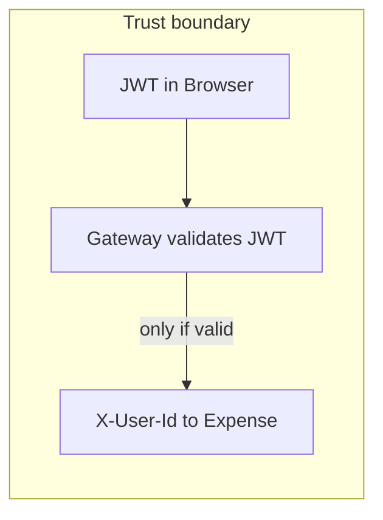
```mermaid
flowchart LR
    subgraph Trust boundary
        JWT[JWT in Browser]
        GW[Gateway validates JWT]
        HDR[X-User-Id to Expense]
    end
    JWT --> GW
    GW -->|only if valid| HDR
```

| Concern | Implementation |
|---------|----------------|
| Password storage | BCrypt never plain text |
| Session token | JWT HS256, configurable expiry |
| Expense isolation | Queries always filter `user_id` |
| Gateway trust | Expense rejects requests without `X-User-Id` |
| CORS | Gateway reflects Origin in dev |

---

## 14. Error handling

| HTTP | When |
|------|------|
| 400 | Validation, business rules (auth facade) |
| 401 | Missing/invalid JWT (gateway or expense header) |
| 404 | Expense not found |
| 502 | Upstream service down (gateway proxy) |
| 500 | PDF generation failure, unhandled server error |

---

## Appendix A — End-to-end demo script (for presentation)

```bash
# 1 Register
curl -X POST http://localhost:8080/api/auth/register -H "Content-Type: application/json" \
  -d "{\"email\":\"demo@example.com\",\"password\":\"Pass123!\",\"name\":\"Demo User\"}"

# 2 Verify (OTP from email or auth console)
curl -X POST http://localhost:8080/api/auth/verify -H "Content-Type: application/json" \
  -d "{\"email\":\"demo@example.com\",\"code\":\"123456\"}"

# 3 Login — save TOKEN from response
curl -X POST http://localhost:8080/api/auth/login -H "Content-Type: application/json" \
  -d "{\"email\":\"demo@example.com\",\"password\":\"Pass123!\"}"

# 4 Create expense
curl -X POST http://localhost:8080/api/expenses -H "Content-Type: application/json" \
  -H "Authorization: Bearer TOKEN" \
  -d "{\"amount\":25.5,\"category\":\"Transport\",\"reason\":\"Bus\",\"location\":\"City\",\"date\":\"2026-05-31T08:00:00Z\"}"

# 5 PDF
curl -X POST http://localhost:8080/api/pdf/generate -H "Content-Type: application/json" \
  -d "{\"html\":\"<html><body><h1>My Expenses</h1></body></html>\"}" --output demo.pdf
```

---

## Appendix B — GoF patterns used (quick reference)

See [DESIGN_PATTERNS.md](DESIGN_PATTERNS.md) for full “what / why / how” per pattern.

| # | Pattern | Module |
|---|---------|--------|
| 1 | Singleton | Database |
| 2 | Builder | Registration |
| 3 | Strategy | Verification |
| 4 | Chain of Responsibility | Login |
| 5 | Facade | AuthenticationFacade |
| 6 | Adapter | Main |
| 7 | Strategy | Expense filters |
| 8 | Factory Method | PDF renderer |
| 9 | Proxy | Integration gateway |

---

*End of technical specification.*
